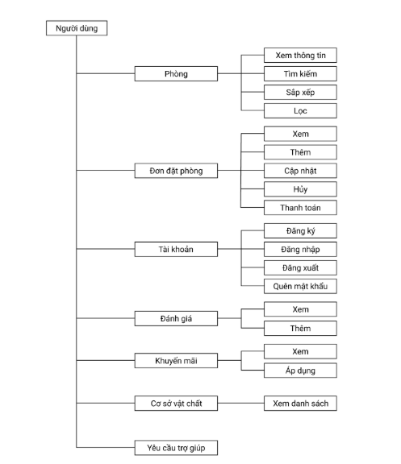
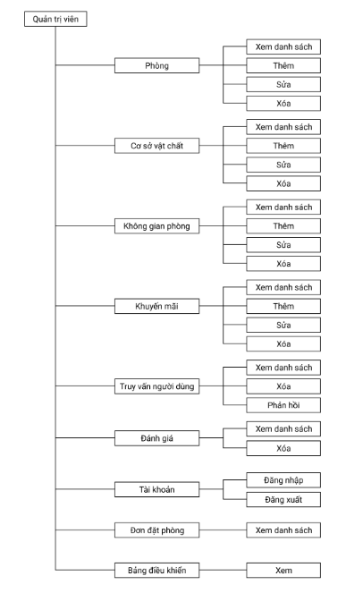

  

<h1 align="center"><b>IS207.P12 - Phát triển ứng dụng web</b></h1>

## Nhóm thực hiện:
| **STT** | **MSSV** | **Họ và tên**       | **Chức vụ** | **Email**              |
| ------- | -------- | ------------------- | ----------- | ---------------------- |
| 1       | 22521172 | Võ Nhất Phương      | Nhóm trưởng | 22521172@gm.uit.edu.vn |
| 2       | 22520861 | Hoàng Gia Minh      | Thành viên  | 22520861@gm.uit.edu.vn |
| 3       | 22520890 | Trần Hữu Hoàng Minh | Thành viên  | 22520890@gm.uit.edu.vn |
| 4       | 22520876 | Nguyễn Nhật Minh    | Thành viên  | 22520876@gm.uit.edu.vn |

## Giới thiệu môn học:
* **Tên môn học:** Phát triển ứng dụng web
* **Mã môn học:** IS207.P12
* **Năm học:** HK1 (2024 - 2025)
* **Giảng viên:** ThS. Mai Xuân Hùng

## Tổng quan về website
Website **Hotel Booking** là một hệ thống đặt phòng khách sạn trực tuyến, hỗ trợ người dùng tìm kiếm, đặt phòng, quản lý đơn đặt phòng, đánh giá dịch vụ và gửi yêu cầu hỗ trợ. Quản trị viên có thể quản lý phòng, cơ sở vật chất, tài khoản, đơn đặt phòng và phản hồi các truy vấn của người dùng. Giao diện thân thiện, dễ sử dụng, phù hợp cho cả người dùng phổ thông và quản trị viên khách sạn.

## Công nghệ được sử dụng
- **Front-end:** HTML, CSS, JavaScript
- **Back-end:** PHP, MySQL
- **Công cụ phát triển:** Visual Studio Code, XAMPP

## Hướng dẫn sử dụng
### 1. Cài đặt môi trường
- Tải và cài đặt XAMPP tại: https://www.apachefriends.org/download.html

### 2. Clone repository về máy
- Mở terminal (Git Bash) trong thư mục `htdocs` của XAMPP
- Chạy lệnh: `git clone https://github.com/vonhatphuongahihi/Hotel-Booking`

### 3. Import cơ sở dữ liệu
- Mở http://localhost/phpmyadmin
- Tạo database mới với tên `hotel_website`
- Import file `hotel_website.sql` vào database vừa tạo

### 4. Chạy website
- Mở XAMPP, khởi động Apache và MySQL
- Truy cập http://localhost/Hotel-Booking trên trình duyệt
- Đăng nhập với tài khoản người dùng:
  - **Email:** hoanggiaminh27012004@gmail.com
  - **Password:** 27012004

### 5. Truy cập trang quản trị (Admin)
- Truy cập http://localhost/Hotel-Booking/admin
- Đăng nhập với tài khoản admin:
  - **Tên đăng nhập:** phuongahihi
  - **Mật khẩu:** 13032004

## Chức năng người dùng

  

## Chức năng quản trị viên

  

